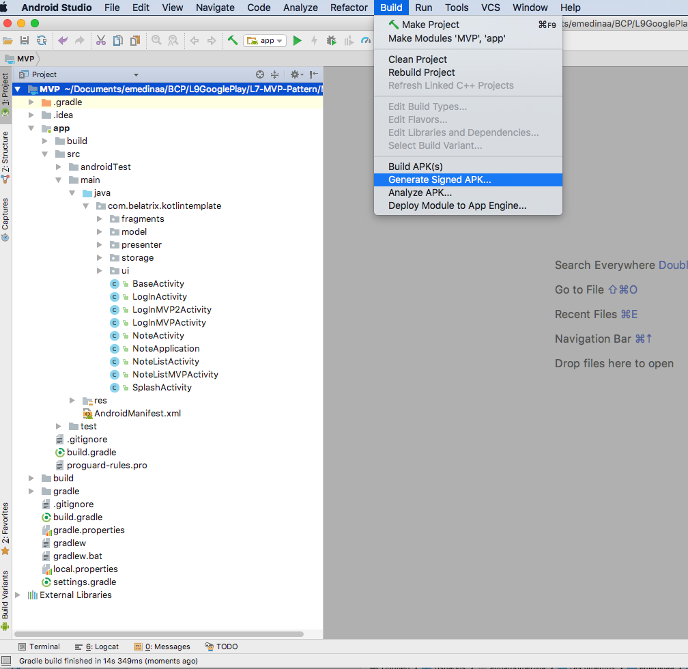
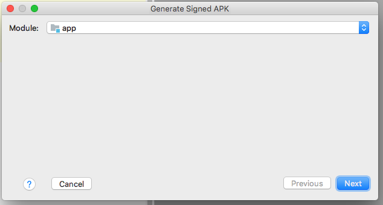
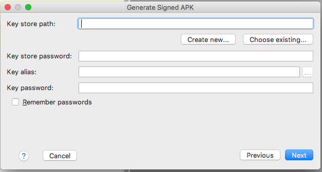
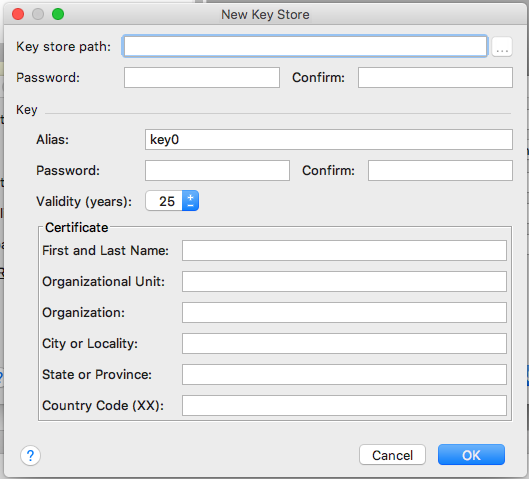
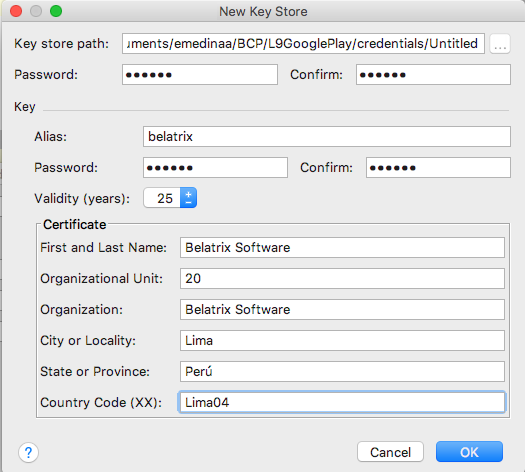
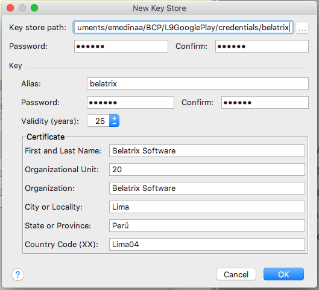
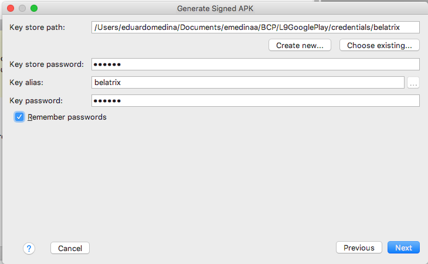
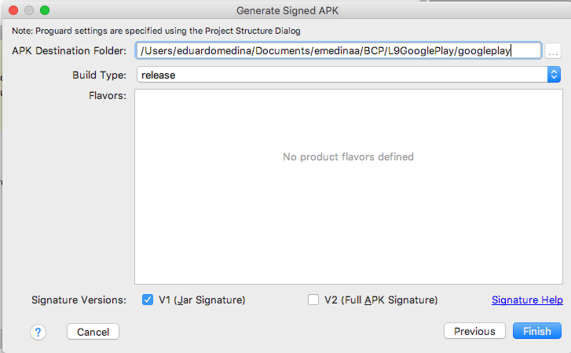
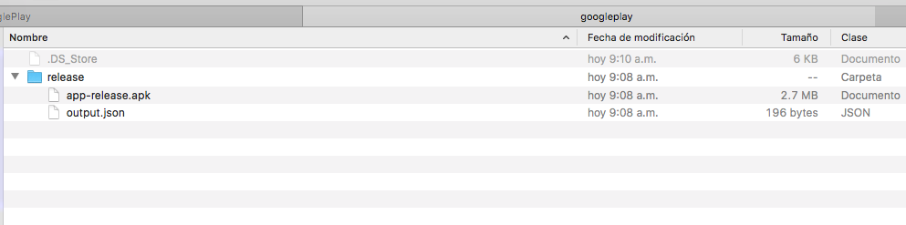
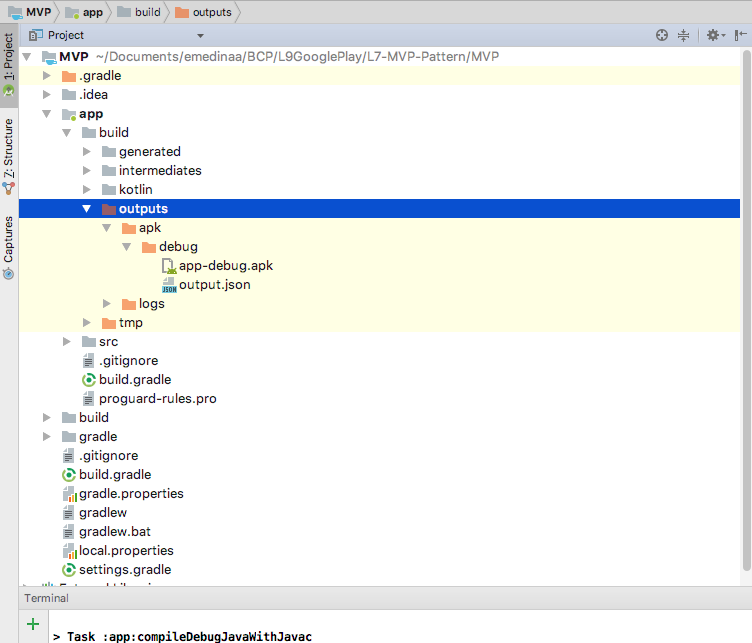

# Android-Intermediate-BCP

Android Intermediate Course -Belatrix BCP - March 2018

## Lesson9

- Preparar Aplicación para producción

  - Crear credenciales 
  
  - Firmar app
  
  - Generar APK

- Google Play console

  - Crear ficha
  
  - Modos de distribución
  
  - Entorno de pruebas
  
  - Publicar App
  
### Preparar Aplicación para producción

- Generar una APK firmada







- Crear credenciales







- Crear APK







- Comandos

```
	./gradlew assembleDebug

	./gradlew installDebug
```




### Google Play console

- Ficha Google Play

Título (50)

Descripción breve (80)

Descripción completa (4000)

Recursos gráficos
	
> Captura de pantalla para teléfono (min 2)

> Icono de alta resolución 512x512

> Imagen destacada 1024x500

> Imagen promocional 180x120

Categorización

> Tipo de app y categoría

- Clasificación de Contenido

- Precio y distribución

- Version de la aplicación

	> Producción (Google play)

	> Beta (Google play)

	> Alfa

	> Prueba interna	


## References 

- Google Play console dashboard https://developer.android.com/distribute/console/index.html

- Google play console https://play.google.com/apps/publish/

- Build Your App from the Command Line https://developer.android.com/studio/build/building-cmdline.html

- Configure Build Variants https://developer.android.com/studio/build/build-variants.html


